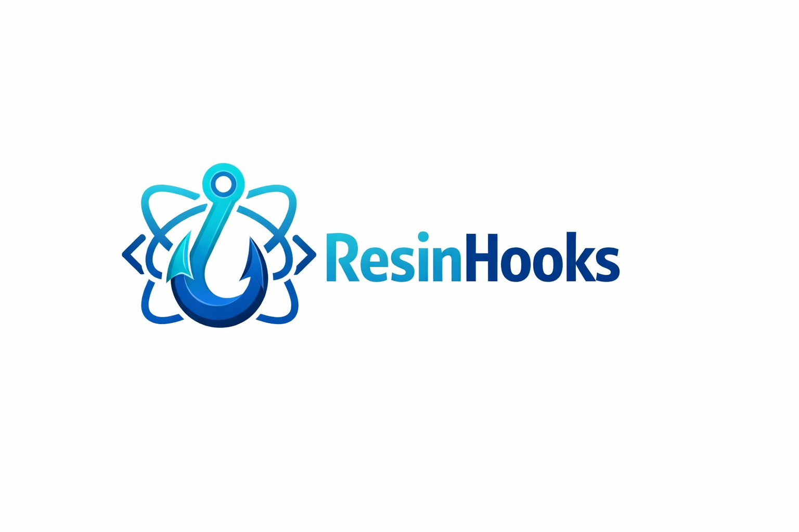

# resin-hooks

## ⚒️ 技术选型

### 包管理工具 -- pnpm

作为基础包，选择社区内更推崇的`pnpm`作为包管理工具，原因有：

1. `pnpm`安装速度更快，磁盘空间利用率高；
2. `pnpm`的`lock`文件适用于多个单一子功能的模块，且能保证每个模块的依赖不耦合；
3. 打包产物清晰，打包后产物确保全部为静态站点资源；

### 构建工具 -- webpack

1. rollup打包hooks包，纯天然tree shaking
2. 选择常用的`webpack`作为构建产物的声明式接入方式；

### 静态文件打包工具 -- rspress

就目前前端社区而言，`rspress`是当之无愧的为组件研发而生的静态站点解决方案；

### 测试工具 -- jest/testing-libary/react

`jest`功能全面，资料丰富，能够很好地支撑原子化集合的工具函数；
`esting-libary/react`测试hook函数

### 演示包 --packages/play

可交互形式演示hook的使用
